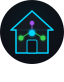

<h1 align="center">&nbsp;Homelable for Home Assistant</h1>

<p align="center">
  <strong>Visualize &amp; monitor your homelab network as an interactive topology inside Home Assistant</strong>
</p>

<p align="center">
  <a href="https://hacs.xyz/"></a>
  <a href="https://github.com/Pouzor/homelable-hacs/releases/latest"></a>
  <a href="https://github.com/Pouzor/homelable-hacs/actions/workflows/validate.yml"></a>
  <a href="https://github.com/Pouzor/homelable-hacs/blob/main/LICENSE"></a>
  <a href="https://github.com/Pouzor/homelable-hacs/issues"></a>
  <a href="https://github.com/Pouzor/homelable-hacs/stargazers"></a>
  <a href="https://github.com/Pouzor/homelable-hacs/network/members"></a>
</p>

<p align="center">
  <a href="#screenshots">Screenshots</a> ·
  <a href="#features">Features</a> ·
  <a href="#installation">Installation</a> ·
  <a href="#configuration">Configuration</a> ·
  <a href="#usage">Usage</a> ·
  <a href="#scanner-privileges">Scanner Privileges</a> ·
  <a href="#roadmap">Roadmap</a>
</p>

## About

This is the Home Assistant integration for
[Homelable](https://github.com/Pouzor/homelable), packaged as a custom
repository for [HACS](https://hacs.xyz/).

Visualize and monitor your homelab network as an interactive topology, right
inside Home Assistant: pan/zoom/drag a full Lovelace panel, discover devices
with a pure-Python scanner (no nmap, no root), watch live status, and import
your Zigbee, Z-Wave, and Proxmox inventories.

Need the standalone (Docker / LXC / Web) version instead? See
[Pouzor/homelable](https://github.com/Pouzor/homelable).

---

## Features

From a **network scanner**  and **Zigbee / Z-Wave / Proxmox** imports to **live status monitoring**, floor plans, multiple canvases and PNG/SVG export, Homelable maps and watches your whole homelab inside Home Assistant.

Every feature, with how to turn it on and use it, is described in **[FEATURES.md](./FEATURES.md)**.

---

## Screenshots


---

## Installation

### HACS (recommended)

1. **HACS → Integrations → ⋮ → Custom repositories**
2. Add `https://github.com/Pouzor/homelable-hacs` as **Integration**.
3. Install **Homelable**.
4. Restart Home Assistant.
5. **Settings → Devices & Services → Add Integration** → search "Homelable".

### Manual

1. Copy `custom_components/homelable/` into your HA `config/custom_components/`.
2. Restart Home Assistant.
3. Add the integration from the UI as above.

### Requirements

- Home Assistant **2024.1** or newer.
- No external binaries. Scanning is pure Python (ping, ARP cache, TCP connect,
  mDNS) and works on every install. Raw socket access unlocks extra detail —
  see [Scanner privileges](#scanner-privileges).

---

## Configuration

Setup is fully UI-driven (config flow). You'll be prompted for:

| Field | Default | Description |
|---|---|---|
| Network ranges | `192.168.1.0/24` | Comma-separated CIDR blocks to scan |
| Scan interval | 60 min | How often to look for new devices |
| Status check interval | 60 s | How often to refresh node status |

All values can be changed later from the integration's **Configure** menu.

---

## Usage

After setup, a **Homelable** entry appears in the sidebar. From there:

1. **Run a scan** to discover devices on the configured ranges.
2. **Approve** a discovered device to drop it on the canvas as a node.
3. **Connect** nodes by drawing edges; pick the appropriate edge type.
4. **Save** the canvas (explicit — no autosave).

Scan history, hidden devices, and scan configuration live in the side panel.

### Dashboard card

The canvas can also be embedded in any Lovelace dashboard, read-only, as a
custom card. Add it from the card picker ("Homelable Canvas") and configure it
in the visual editor — the design is picked from a dropdown of your canvases.

The same options in YAML:

```yaml
type: custom:homelable-canvas-card
design_id: 3f2b1c4e-...   # optional — the first design when omitted
title: Network            # optional card header
height: 500               # px, default 400
fit_view: true            # fit the canvas to the card on load, default true
interactive: pan          # pan (default) or none to lock the view
open_on_click: false      # click a node to open http://<its ip>, default off
```

The card shows live status the same way the panel does. Editing is disabled —
build the canvas in the panel, then display it here.

Two notes on its behaviour:

- The mouse wheel scrolls the dashboard rather than zooming the canvas. Use
  Ctrl+wheel, or the zoom buttons, to zoom.
- The canvas refits itself whenever the card is resized, so it follows a
  Sections layout or a window resize without clipping.
- **Only one Homelable card per dashboard view.** The canvas state is shared
  process-wide, so a second card on the same view shows a notice instead of a
  canvas. Put additional canvases on separate views.

---

## Scanner privileges

The scanner always works without privileges: ping sweep, ARP cache reads, a
pure-Python TCP connect scan for service detection, and mDNS / zeroconf.
Raw socket access (ICMP ping, richer ARP) yields more reliable host discovery
and MAC addresses. Without it, the scanner still finds hosts via the TCP sweep
fallback — slower, and MAC addresses may be missing.

| Install type | Notes |
|---|---|
| **HAOS / Supervised** | Works out of the box; ping/ARP run with the privileges HA already has. |
| **Container** | Run the HA container with `CAP_NET_RAW` for ICMP ping + ARP; otherwise the TCP connect fallback is used automatically. |
| **Core** | Grant the Python interpreter ICMP access (`setcap cap_net_raw+ep $(readlink -f $(which python3))`) for ping, or rely on the TCP fallback. |

---

## Roadmap

- Multiple Homelable cards on one dashboard view.
- HA entities per canvas node (`sensor.homelable_<id>`, `binary_sensor.homelable_<id>_online`).
- Device registry: one HA device per canvas node.
- Services: `homelable.scan_now`, `homelable.approve_device`, `homelable.refresh_status`.
- Events: `homelable_node_offline`, `homelable_node_online`, `homelable_device_discovered`.
- HACS default-listing submission once stable with real users.

See the [issue tracker](https://github.com/Pouzor/homelable-hacs/issues) for
the live list.

---

## Contributing

Issues and pull requests are welcome. Please:

- Open an issue first for non-trivial changes so we can align on scope.
- Keep PRs focused and include tests for behavior changes.
- Use [Conventional Commits](https://www.conventionalcommits.org/) (`feat:`,
  `fix:`, `chore:`, `docs:`, `test:`, `refactor:`).

---

## License

[MIT](LICENSE) © Pouzor
